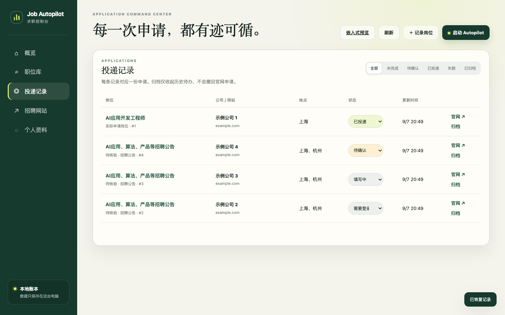

# Job Autopilot

> 维护一份纯净的 27 届秋招职位库，完成招聘网站表单，并用本地账本记住每一次投递。

Job Autopilot 是一个 Codex 插件。它把 2027 届秋招职位快照、JDWatch 补充查询、Codex 浏览器自动化和 Android ADB 验证码读取串成一条可审计的投递工作流。

仓库随附一份去重后的公开职位快照。控制台默认筛选“计算机 / 开发 / Agent”方向，也可以切换到 Agent / AI、开发 / 后端、计算机相关或全部岗位。

[查看职位数据](data/jobs.json) · [数据说明](data/README.md) · [快速开始](#快速开始)



主要操作：

- “帮我找 27 届 Agent / 后端岗位并加入队列”
- “继续处理待投岗位，填写到提交前让我确认”
- “打开 Job Autopilot 控制台”

## 它解决什么

- **避免重复投递**：按 JDWatch Job ID 和规范化官网 URL 去重。
- **保留事实边界**：只使用本地个人资料填写；缺失或主观问题会暂停，不编造答案。
- **每一步可追踪**：打开网站、需要登录、正在填写、待确认、已提交和失败都有时间线。

## 能力

- 27 届秋招职位库：随插件导入 3233 个去重后的公开职位，默认筛选计算机、开发和 Agent 方向；关键词和地点均支持用空格、逗号或顿号输入多个条件。
- 补充岗位发现：通过 `@jdwatch/cli` 查询其他范围的已核验岗位。
- 申请队列：分别保存招聘公告和实际申请岗位、地点与官网链接；可查看详情、修正记录或归档历史草稿，保留原始状态与提交凭证。
- 求职偏好：保存岗位方向、城市、招聘类型、排除项和登录偏好，新任务自动沿用。
- 浏览器执行：登录招聘网站、填写表单、上传简历和保存提交凭证。
- 手机验证：招聘网站支持时默认使用手机号登录，通过已授权的 ADB 设备读取新验证码；不保存短信正文。
- AI 简历导入：提取 PDF、DOCX、TXT 或 Markdown，由 AI 理解后生成待确认字段。
- 动态资料库：新表单问题在你确认后沉淀为带别名和适用范围的可复用事实。
- 共享实时进展：无论从独立网页、嵌入式 UI，还是任意 Codex 对话启动，都在两个前端同步显示当前阶段、岗位和批次进度。
- 嵌入式控制台：在 Codex 中直接查看漏斗、启动或暂停任务，并把请求发送给当前对话。
- 独立控制台：在普通浏览器中直接启动或恢复长期 Codex 任务，并维护申请记录、个人资料和确认项。

## 快速开始

前置条件：

- Codex 桌面版及 Browser 插件
- 已安装并登录的 `@jdwatch/cli`
- 如需短信登录：Android 手机已通过 ADB 授权连接

安装插件后，在一个新的 Codex 任务中说“打开 Job Autopilot”，即可加载 MCP 嵌入式控制台。它和独立网页使用同一个本地数据库。

如需在普通浏览器中使用完整管理页面：

```bash
scripts/job-autopilot init
scripts/job-autopilot serve
```

独立控制台默认地址：`http://127.0.0.1:8765/`，嵌入式样式也可在 `/embedded` 预览。

首次启动时，插件会在空职位库中自动导入仓库随附的公开职位快照。然后在“个人资料”中填写真实信息并选择简历路径。默认模式为“提交前确认”；切换到自动推进后，只会对允许的网站自动执行到最终确认页。同一岗位的登录、验证码、填表与上传不重复确认，只在最终提交前确认一次。

独立控制台的“启动 Autopilot”会通过本机 Codex App Server 直接创建或恢复一个长期任务，实时同步运行状态，并在需要补充资料、处理执行环境权限或确认最终提交时，在网页中显示请求。MCP 嵌入式控制台仍会把请求交给当前 Codex 对话。普通 Codex 对话中的插件任务也会把安全的阶段摘要写入同一活动流；手机号、邮箱、验证码、简历正文和表单答案不会进入这份前端日志。

## 数据与隐私

公开仓库不包含职位抓取实现；抓取只在维护者本机完成。仓库仅发布审核后的 `data/jobs.json` 快照，详见 [数据说明](data/README.md)。

所有状态默认保存在 `~/.job-autopilot/state.db`。个人资料保存在同一数据库中；验证码与确认回答仅在需要时传给当前任务，不进入数据库或事件日志。

插件不会绕过验证码、网站风控或使用条款。遇到 CAPTCHA 时只调用当前浏览器能力支持的验证流程；自动验证失败、出现额外声明、开放性问题或无法确认提交结果时会暂停。

## 目录

- `skills/job-autopilot/`：Codex 工作流与安全边界
- `.mcp.json`：随插件加载的本地 MCP 服务声明
- `runtime/job_autopilot/`：公开职位快照、本地账本、JDWatch/ADB 适配和 Web 控制台
- `data/jobs.json`：只含公开字段的 2027 届秋招职位快照
- `scripts/job-autopilot`：命令入口；`scripts/job-autopilot-mcp`：MCP STDIO 入口
- `tests/`：本地单元测试

## 开发验证

```bash
PYTHONPATH=runtime python3 -m unittest discover -s tests -q
```

界面回归覆盖空表单关闭、详情修改、归档恢复、偏好保存、断线恢复和四种窗口宽度。需先安装 Playwright（`npm install --no-save playwright` 和 `npx playwright install chromium`），再运行：

```bash
node tests/dashboard.e2e.cjs
```

测试自动创建临时数据库和本地服务，不读取个人投递记录，也不会发起真实投递。可用 `BROWSER_EXECUTABLE` 指定已安装的 Chrome/Edge，用 `SCREENSHOT_DIR` 指定截图目录。

## License

插件代码采用 [MIT License](LICENSE)。职位快照是公开事实汇编，原始职位描述与链接的权利归各发布方所有。
